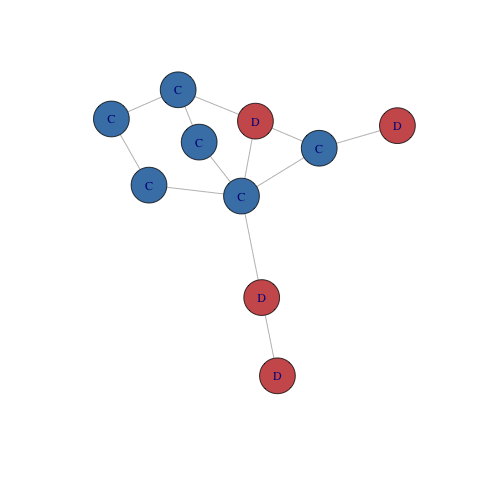
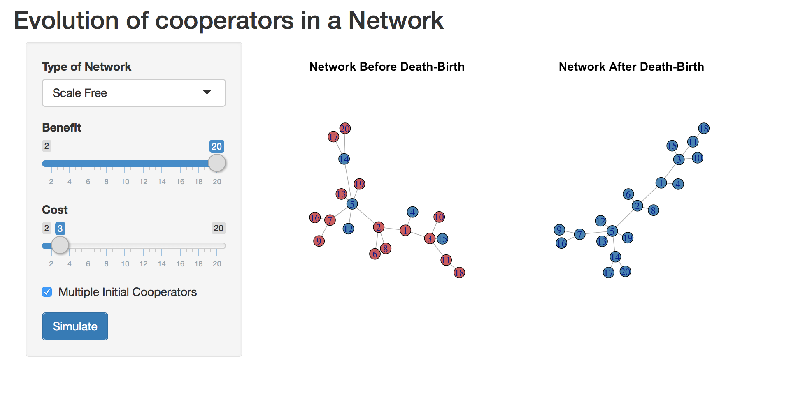
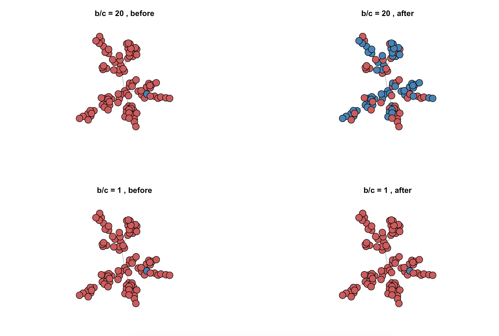
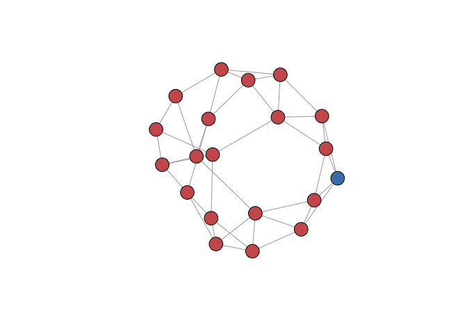
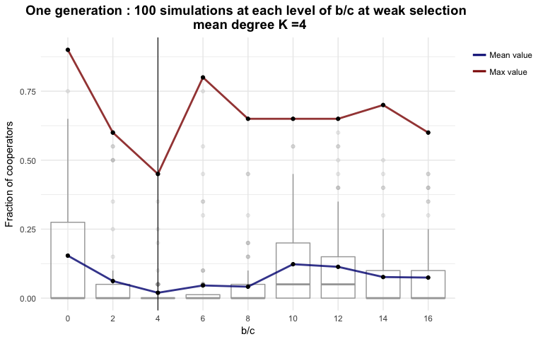
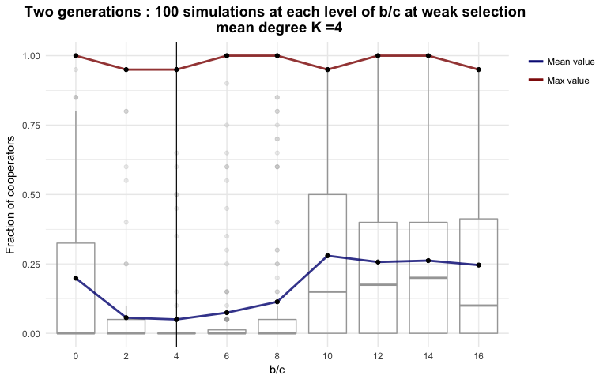
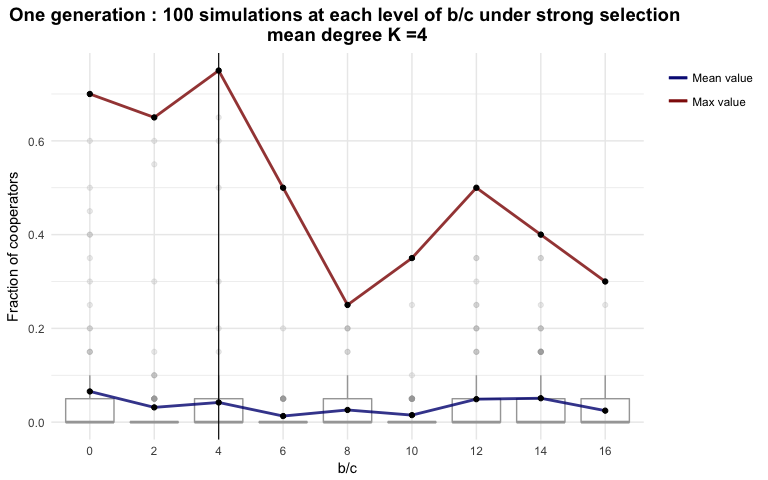
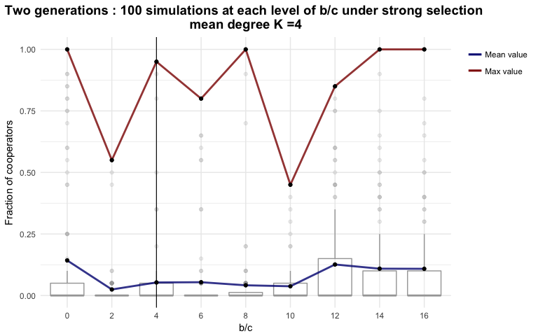

Using Networks to study the Evolution of Cooperation
================
Bianca Brusco bb1569
12/5/2017

A bit of background...
----------------------

### Why Evolutionary Game Theory?

Under Darwin's theory of **Natural Selection**, evolution in a population is intended as the propagation of particular genes that increase the fitness of the present individuals. Those who are more fit tend to produce more offspring, so that those genes are proportionally more represented in the population.

Many behaviours, however, do not depend on the single gene of the single individual, but rather on how posessing a certain behavioural characteristic increases (or decreases) the individual's fitness in its interactions with other memebers of the population. As a consequence, the fitness brought by a gene ( or a set of genes) should not measured in isolation, but rather in the context of the entire population that the organism is part of.

In particular, we examine the attribute **"Cooperation"**. In this context, Cooperation is seen as a binary characteristic (either "cooperator"" or "defector"") of an individual, rather than as a spectrum. We can intuitively see how the benefit of Cooperation depends on the charactersitcs of the population as a whole: if I am the only animal helping the population to feed itself, I risk wasting a lot of energy gathering food that I will not eat, therefore decreasing my overall fitness for the benefit of my neighbours. However, if all my neighbours are cooperators, we can explore more food sources than a single individual, and as a whole, we are more likely to collect more food per individual that if we were to scavange alone.

The evolution of cooperation in animal populations has long been a subject of investigation. The fact that some animals cooperate seems, at a first glance, to oppose Darwin's Natural Selection theory: the genes of those who benefit from the help of others, while not wasting any resources if not on themseleves, are most likely to be passed on, as those individuals are likely to be the fittest.

One important theory in evolutionary biology, that reconciled the empirical observation with the theory of Natural Selection, was developed by Hamilton in 1981 . Hamilton argued that individuals do not only want to benefit their own fitness, but rather the fitness of individuals who share their gene pool. For example, Hamilton's theory explained why some ants spend their lives helping the Queen ant rather than focusing on reproducing. Indeed, they share more genes with their sister (Queen ant), than with their potential offspring.

In more recent years, the evolution of cooperation has been examined through different lenses, taking a game theoretical approach. The interaction of members of a population can be seen has an "evolutionary game", in which there is a dominant strategy, which not only depends on the two individual's fitness (or "payoff") but rather on the overall characteristics and fitness of the population. In some cases, the dominant strategy is "cooperator", in some, it is not.

### Why networks?

Many evolutionary games have been modeled on fully connected population, in which all individuals interact with each other. However, this is not very representative of real population. Networks can be very valuable for the study of evolutionary games because they represent properly interaction among individuals, and population structures are more realistically under this setting.

My project
----------

All the code used throughout to generate visualizations or results in this presentation is in apsta-net17/biabiassago repo.

### Testing Evolution of Cooperation

In this project, my initial aim was to replicate the results published by Outhsuki et al. in 2006. In the paper, the authors explore the evolution of cooperation in networks, investigating of the number of neighbours that each node has is an important variable. They prove that a *necessary condition* for cooperation to evolve is for the ratio of benefit of having cooperators as neighbours(b) over cost of helping them (c) to be larger than the number of neighbours (k). I.e b/c > k. This means: the less neighbours you interact with, the more you have to rely on them. And therefore, the more chances there are that you pick a cooperating strategy.

The authors test multiple cycles of simulation by introducing one single cooperator in a population of defectors, and observe in which cases the cooperator attribute evolves among all individuals.

They argue that if the cooperation attribute is neutral (i.e. it neither increases nor decreases fitness) then the probability of a single cooperator turning the enitre population into defectors (called "fixation probability") is of 1/N (with N, number of nodes). If the fixation probability of a single cooperator is greater than 1/N, then selection favors the emergence of cooperation.

Therefore they study the fixation probability of cooperation attribute, by performing 10^6 simulations in each different settings (i.e. different values of benefit, cost and different types of networks). They then examine in how many of these simulations the cooperation attribute has fixated. They demonstrate that $\\frac{b}{c}&gt; k$ is a necessary condition (albeit not sufficient) for cooperation to be favoured by natural selection.

In this project, I do not have time nor resources to run multiple 10^6 simulation for different conditions. Therefore, I decided to explore how networks can be used for evolutionary game theory games, by writing my own simulation, and building an interactive tool to visualize it.

Moreover, I will ran 100 rounds of my simulations on a small world network with 20 nodes, to see if the b/c > k rule seems to hold.

``` r
library(igraph)
library(shiny)
library(knitr)
library(ggplot2)
library(gridExtra)
source("./functions.R")
set.seed(1993)
```

### Developing the simulation

To develop this simulation I wrote several functions that I describe below. The code can be found in this repository in functions.R.

-   assignType() : this function picks a random individual in the network an assignes it the attribute of cooperator "C", and it assignes "D", defector, to all others.

-   assignColor() : for visualization purposes. Assignes vertex color red to defectors and blue to cooperators.
-   nodeFit() : this function assigns "fitness" to each node. This characterstic is based on whether the node is a cooperator or a defector, and on the charactersitics of its neighbours. Specifically,

	
	__Fitness__ = 1- w- (benf*i - cost*k)*w.   
	benf = benefit gained from being neighbour to some cooperators. 
	cost = cost lost from helping neighbours by being a cooperators.   
	i = number of cooperatoring neighbours. 
	k = number of neighbours.  
	w : determines whether we are under strong selection (one attribute is largely better than another, in which case w=1), or under weak selection 	(the fitness increase from one
	attribute rather than the other is small, in which case w<<1).  	


-   netFit() : assign fitness to whole network, node by node.

-   deathBirth() : death Birth updating for one node. See below for more on death Birth Updating.
-   netUpdate() : death birth through whole network
-   simDistCoop() : this function simulates deathBirth for the whole network multiple times. It then calculates, for each simulation, the percentage of cooperators at the end of the evolutionary process. It returns an array with percentage of cooperators in each of the simulations.

### The process : Death-Birth updating

To simulate evolution of a population, I developed a simulation to replicate a Death-Birth updating on a Network. In a death-birth network update, one individual is chosen at random to die at time t=1. Hence, its neighbouring nodes compete for its spot. This can be immagined as a race between two groups: the cooperators and the defectors. Who wins the race is determined by a probabilistic function that takes into account the overall fitness of each group

In this case, I define the probability of a cooperator winning to be:

Pc = F_c/(F\_c + F\_d)

as defined in Outhsuki et al. (2006).
where:

F_c : fitness of neighbouring cooperators
F_d : fitness of neighbouring defectors

I conducted this preliminary investigations under weak selection, as advised in Outhsuki et al. (2006), although it would be interesting to examine the strong selection case.

In the image below, we can visualize the death-Birth update in a network that starts with 6 cooperators and 4 defectors, and eventually turns in a full-cooperators population.



#### What is happening? Visualizing in a Shiny App

In this Shiny App, we explore the netUpdate() function in different networks with 20 nodes each. User can define benefit and cost, and chose among 4 different sample networks.

**link to app**: <https://biabbiassago.shinyapps.io/finalProject/>

The code to create the app is in the files server.R and ui.R in this directory.



#### The process on a Scale Free Network

``` r
sampleScale_up = netUpdate(sampleScale, benf = benf_1, cost = cost_1, rounds = 500)
sampleScale_up = assignColor(sampleScale_up)

lay = layout.fruchterman.reingold(sampleScale)

sampleScale2_up = netUpdate(sampleScale2, benf= benf_2, cost= cost_2, rounds = 500)
sampleScale2 = assignColor(sampleScale2)
sampleScale2_up = assignColor(sampleScale_up)

lay = layout.fruchterman.reingold(sampleScale2)

par(mfrow = c(1,2))
plotScale1 = plot(sampleScale, layout= lay, vertex.label=NA, main = "b/c = 20 , before")
plotScale2 = plot(sampleScale_up,layout= lay, vertex.label=NA, main = "b/c = 20 , after")

plotScale3 = plot(sampleScale2,layout= lay, vertex.label=NA, main = "b/c = 1 , before")
plotScale4 = plot(sampleScale2,layout= lay, vertex.label=NA, main = "b/c = 1 , after")
```



### Small World Network - simulations

To understand what happens on average, and for different level of benefit-cost ratio, I ran 100 simulations for each of 9 levels of b/c, from 0 to 16. What is the maximum percentage of cooperators for each of these levels? I decided to run these simulations on a Small World Network, which is a good representation of population. The network used has 20 nodes and a mean degree k = 4.

#### Weak selection

``` r
##Under weak selection
smallestW = sample_smallworld(1, 20, 2, 0.1, loops = FALSE, multiple = FALSE)
smallestWTest = assignType(smallestW)
smallestWTest = assignColor(smallestWTest)
smallestWTest = netFit(smallestWTest, benf = 5, cost = 1, w = 0.1)
plot(smallestWTest)


#1 Generation
dataProp_weak = array(dim = c(100,9))
i = 1
for(r in seq(0,16,2)){
  currentFrac = simDistCoop(net = smallestWTest, benf = r, cost = 1, w=0.1, sims=100,rounds=75)
  dataProp_weak[,i] = currentFrac
  i = i + 1
}

write.csv(dataProp_weak, "dataProp_weak.csv")

#2 Generations 
dataProp_weak_two = array(dim = c(100,9))
i = 1
for(r in seq(0,16,2)){
  currentFrac = simDistCoop(net = smallestWTest, benf = r, cost = 1, w=0.1, sims=100,rounds=150)
  dataProp_weak_two[,i] = currentFrac
  i = i + 1
}

write.csv(dataProp_weak_two, "dataProp_weak_two.csv")
```

The small-world network:

    ## [1] "The mean degree is 4"



**After one generation**

``` r
dataProp_weak = read.csv("dataProp_weak.csv")
dataProp_weak$X = NULL


#Summaries and plot

colnames(dataProp_weak) = c(seq(0,16,2))

#first five simulations for each b/c level
head(dataProp_weak,5)
```

    ##      0    2    4 6    8   10  12   14   16
    ## 1 0.25 0.00 0.00 0 0.00 0.15 0.0 0.25 0.05
    ## 2 0.05 0.60 0.00 0 0.00 0.00 0.0 0.05 0.00
    ## 3 0.35 0.00 0.05 0 0.00 0.00 0.0 0.00 0.00
    ## 4 0.00 0.00 0.35 0 0.00 0.00 0.0 0.00 0.00
    ## 5 0.00 0.05 0.05 0 0.05 0.30 0.1 0.00 0.00

``` r
print("The means for each column are:")
```

    ## [1] "The means for each column are:"

``` r
kable(t(colMeans(dataProp_weak)), caption = "Mean fraction of Cooperators for different b/c")
```

|      0|      2|       4|      6|       8|     10|      12|      14|      16|
|------:|------:|-------:|------:|-------:|------:|-------:|-------:|-------:|
|  0.154|  0.062|  0.0195|  0.046|  0.0415|  0.123|  0.1135|  0.0765|  0.0745|

``` r
kable(t(apply(dataProp_weak,2,max)), caption = "Max fraction of Cooperators for different b/c")
```

|    0|    2|     4|    6|     8|    10|    12|   14|   16|
|----:|----:|-----:|----:|-----:|-----:|-----:|----:|----:|
|  0.9|  0.6|  0.45|  0.8|  0.65|  0.65|  0.65|  0.7|  0.6|

``` r
sim_plot1 = ggplot(stack(dataProp_weak), aes(x = factor(ind, levels = names(dataProp_weak)), y = values), fill = "Legend") +
    geom_boxplot(alpha = 0.2, colour = "grey65")+ 
    labs(title="One generation : 100 simulations at each level of b/c at weak selection \n mean degree K =4",x="b/c", y = "Fraction of cooperators") +
    stat_summary(fun.y = mean, geom = "line", aes(color = "navyblue", group=1), size = 1, alpha = 0.8)  + 
    stat_summary(fun.y = mean, geom = "point") +
    stat_summary(fun.y = max, geom = "line", size = 1, aes(color = "red4", group=1), alpha = 0.8) +
    stat_summary(fun.y = max, geom = "point") +
  geom_vline(xintercept= 3 , size = 0.4)
  
   

sim_plot1 + theme_minimal() + theme(plot.title = element_text(face="bold", size=14, hjust=0.5), legend.justification = "top", legend.title = element_blank()) + scale_colour_manual(values =c('red4'='red4','navyblue'='navyblue'), labels = c('Mean value','Max value'))
```



At one generation and under weak selection, the ratio of benefit to cost does not seem to have much of an effect. Actually, we see that the highest percentage of cooperators has occurred in one simulation at b/c = 0. The mean does not seem to have an upward trend, nor do the max values.

**After two generations:**

I will then look at what happens over two generations, still under weak selection:

``` r
dataProp_weak_two = read.csv("dataProp_weak_two.csv")
dataProp_weak_two$X = NULL


colnames(dataProp_weak_two) = c(seq(0,16,2))

#first five simulations..
head(dataProp_weak_two,5)
```

    ##      0    2    4 6   8   10   12  14   16
    ## 1 0.45 0.00 0.00 0 0.4 0.05 0.05 0.4 0.15
    ## 2 0.00 0.00 0.00 0 0.0 0.10 0.00 0.0 0.55
    ## 3 1.00 0.55 0.05 0 0.0 0.55 0.00 0.2 0.45
    ## 4 0.00 0.05 0.00 0 0.8 0.00 0.00 0.3 0.35
    ## 5 0.00 0.00 0.00 0 0.0 0.30 0.00 0.0 0.40

``` r
print("The means for each column are:")
```

    ## [1] "The means for each column are:"

``` r
kable(t(colMeans(dataProp_weak_two)), caption = "Mean fraction of Cooperators for different b/c")
```

|       0|       2|     4|       6|       8|      10|     12|     14|     16|
|-------:|-------:|-----:|-------:|-------:|-------:|------:|------:|------:|
|  0.1985|  0.0565|  0.05|  0.0745|  0.1135|  0.2795|  0.257|  0.262|  0.246|

``` r
kable(t(apply(dataProp_weak_two,2,max)), caption = "Max fraction of Cooperators for different b/c")
```

|    0|     2|     4|    6|    8|    10|   12|   14|    16|
|----:|-----:|-----:|----:|----:|-----:|----:|----:|-----:|
|    1|  0.95|  0.95|    1|    1|  0.95|    1|    1|  0.95|

``` r
sim_plot2 = ggplot(stack(dataProp_weak_two), aes(x = factor(ind, levels = names(dataProp_weak_two)), y = values), fill = "Legend") +
    geom_boxplot(alpha = 0.2, colour = "grey65")+ 
    labs(title="Two generations : 100 simulations at each level of b/c at weak selection \n mean degree K =4",x="b/c", y = "Fraction of cooperators") +
    stat_summary(fun.y = mean, geom = "line", aes(color = "navyblue", group=1), size = 1, alpha = 0.8)  + 
    stat_summary(fun.y = mean, geom = "point") +
    stat_summary(fun.y = max, geom = "line", size = 1, aes(color = "red4", group=1), alpha = 0.8) +
    stat_summary(fun.y = max, geom = "point") +
  geom_vline(xintercept= 3 , size = 0.4)

sim_plot2 + theme_minimal() + theme(plot.title = element_text(face="bold", size=14, hjust=0.5), legend.justification = "top", legend.title = element_blank()) + scale_colour_manual(values =c('red4'='red4','navyblue'='navyblue'), labels = c('Mean value','Max value'))
```



In this case, we see that some of the simulations have reached a full population of cooperators. These are at values of b/c = 0, 6, 8, 12 and 14. These seems to contraddict the paper's claim that a necessary condition to achieved a full population of cooperators is for b/c &gt; k = 4 (in our case) However, I note that I have introduced in my simulation a condition for which the min value of evolution of a cooperator is 1%, so that this has affected the case of benefit = 0. I will remove this in the future to observe the results.

If we disregard the case of b/c = 0, we see that from two onwards there is an increasing trend of the mean, that seems to converge at 0.25 after benefit/cost = 10. In future analysis, I intend to analyze whether this is a stable state for the specific number of generations (two).

#### Under strong selection

I then run the same simulaiton but under strong selection conditions, i.e. when w = 1.

``` r
#UNDER STRONG SELECTION

#di notte venerdi
smallestW_strong = sample_smallworld(1, 20, 2, 0.1, loops = FALSE, multiple = FALSE)
smallestWTest_strong = assignType(smallestW_strong)
smallestWTest_strong = assignColor(smallestWTest_strong)
smallestWTest_strong = netFit(smallestWTest_strong, benf = 5, cost = 1, w = 1)


#1 Generation
dataProp_strong = array(dim = c(100,9))
i = 1
for(r in seq(0,16,2)){
  currentFrac = simDistCoop(net = smallestWTest_strong, benf = r, cost = 1, w=1, sims=100,rounds=75)
  dataProp_strong[,i] = currentFrac
  i = i + 1
}

write.csv(dataProp_strong, "dataProp_strong.csv")

#2 Generations 
dataProp_strong_two = array(dim = c(100,9))
i = 1
for(r in seq(0,16,2)){
  currentFrac = simDistCoop(net = smallestWTest_strong, benf = r, cost = 1, w=1, sims=100,rounds=150)
  dataProp_strong_two[,i] = currentFrac
  i = i + 1
}

write.csv(dataProp_strong_two, "dataProp_strong_two.csv")
```

**After one Generation:**

``` r
dataProp_strong = read.csv("dataProp_strong.csv")
dataProp_strong$X = NULL


#Summaries and plot

colnames(dataProp_strong) = c(seq(0,16,2))

#first five simulations for each b/c level
head(dataProp_strong,5)
```

    ##      0   2    4    6   8   10   12 14   16
    ## 1 0.00 0.1 0.00 0.00 0.0 0.00 0.00  0 0.00
    ## 2 0.00 0.0 0.00 0.00 0.0 0.00 0.25  0 0.05
    ## 3 0.35 0.0 0.00 0.00 0.0 0.00 0.05  0 0.00
    ## 4 0.05 0.0 0.05 0.00 0.1 0.05 0.30  0 0.00
    ## 5 0.00 0.0 0.00 0.05 0.0 0.05 0.05  0 0.00

``` r
print("The means for each column are:")
```

    ## [1] "The means for each column are:"

``` r
kable(t(colMeans(dataProp_strong)), caption = "Mean fraction of Cooperators for different b/c")
```

|       0|       2|      4|      6|      8|     10|     12|     14|      16|
|-------:|-------:|------:|------:|------:|------:|------:|------:|-------:|
|  0.0655|  0.0315|  0.042|  0.013|  0.026|  0.015|  0.049|  0.051|  0.0245|

``` r
kable(t(apply(dataProp_strong,2,max)), caption = "Max fraction of Cooperators for different b/c")
```

|    0|     2|     4|    6|     8|    10|   12|   14|   16|
|----:|-----:|-----:|----:|-----:|-----:|----:|----:|----:|
|  0.7|  0.65|  0.75|  0.5|  0.25|  0.35|  0.5|  0.4|  0.3|

``` r
sim_plot3 = ggplot(stack(dataProp_strong), aes(x = factor(ind, levels = names(dataProp_strong)), y = values), fill = "Legend") +
    geom_boxplot(alpha = 0.2, colour = "grey65")+ 
    labs(title="One generation : 100 simulations at each level of b/c under strong selection \n mean degree K =4 ",x="b/c", y = "Fraction of cooperators") +
    stat_summary(fun.y = mean, geom = "line", aes(color = "navyblue", group=1), size = 1, alpha = 0.8)  + 
    stat_summary(fun.y = mean, geom = "point") +
    stat_summary(fun.y = max, geom = "line", size = 1, aes(color = "red4", group=1), alpha = 0.8) +
    stat_summary(fun.y = max, geom = "point") +
  geom_vline(xintercept= 3, size = 0.4)
  
   

sim_plot3 + theme_minimal() + theme(plot.title = element_text(face="bold", size=14, hjust=0.5), legend.justification = "top", legend.title = element_blank()) + scale_colour_manual(values =c('red4'='red4','navyblue'='navyblue'), labels = c('Mean value','Max value'))
```



Under strong selection there is more variability in the max values of the different b/c levels, but the mean remains pretty stable at one generation.

**After two generations**

``` r
dataProp_strong_two = read.csv("dataProp_strong_two.csv")
dataProp_strong_two$X = NULL


#Summaries and plot

colnames(dataProp_strong_two) = c(seq(0,16,2))

#first five simulations for each b/c level
head(dataProp_strong_two,5)
```

    ##   0    2 4    6 8  10   12  14  16
    ## 1 0 0.00 0 0.65 0 0.0 0.00 0.5 0.8
    ## 2 0 0.00 0 0.10 0 0.0 0.15 0.0 0.0
    ## 3 0 0.45 0 0.00 0 0.1 0.15 0.0 0.0
    ## 4 0 0.00 0 0.00 0 0.0 0.00 0.0 0.0
    ## 5 0 0.00 0 0.00 0 0.0 0.00 1.0 0.0

``` r
print("The means for each column are:")
```

    ## [1] "The means for each column are:"

``` r
kable(t(colMeans(dataProp_strong_two)), caption = "Mean fraction of Cooperators for different b/c")
```

|       0|       2|      4|      6|       8|      10|     12|     14|      16|
|-------:|-------:|------:|------:|-------:|-------:|------:|------:|-------:|
|  0.1425|  0.0245|  0.053|  0.054|  0.0415|  0.0375|  0.126|  0.109|  0.1085|

``` r
kable(t(apply(dataProp_strong_two,2,max)), caption = "Max fraction of Cooperators for different b/c")
```

|    0|     2|     4|    6|    8|    10|    12|   14|   16|
|----:|-----:|-----:|----:|----:|-----:|-----:|----:|----:|
|    1|  0.55|  0.95|  0.8|    1|  0.45|  0.85|    1|    1|

``` r
sim_plot4 = ggplot(stack(dataProp_strong_two), aes(x = factor(ind, levels = names(dataProp_strong_two)), y = values), fill = "Legend") +
    geom_boxplot(alpha = 0.2, colour = "grey65")+ 
    labs(title="Two generations : 100 simulations at each level of b/c under strong selection \n mean degree K =4 ",x="b/c", y = "Fraction of cooperators") +
    stat_summary(fun.y = mean, geom = "line", aes(color = "navyblue", group=1), size = 1, alpha = 0.8)  + 
    stat_summary(fun.y = mean, geom = "point") +
    stat_summary(fun.y = max, geom = "line", size = 1, aes(color = "red4", group=1), alpha = 0.8) +
    stat_summary(fun.y = max, geom = "point") +
  geom_vline(xintercept= 3, size = 0.4)
  
   

sim_plot4 + theme_minimal() + theme(plot.title = element_text(face="bold", size=14, hjust=0.5), legend.justification = "top", legend.title = element_blank()) + scale_colour_manual(values =c('red4'='red4','navyblue'='navyblue'), labels = c('Mean value','Max value'))
```



As observed under weak selection, the reason why one simulation at b/c = 0 reached a fraction of 1 might be because I allow for random mutations in the model. Other than that, we see again a larger level of variation under strong selection. The mean seems to increase after b/c = 12 and it might be reaching a stable conidition of around a fraction of around 0.12 (for this number of generations).

Note: in most of the simulations, the mode (as well as the median) is 0. This makes sense, because we start from one single cooperator which has a high chance of being overtaken. However, this is probably influence by where the intiial cooperator is placed and what its centrality measures are. I.e., if the first cooperator has many neighbours or not, this probably would change how many simulations end up with a fraction of 0 cooperators.

My hypothesis is that after many generations, there would be a level of b/c for which the fraction of cooperators would converge to 0.99 ( if we allow for random mutation of defectors at 1%) although I hope to gain a better understanding after examining the analytical solution.

Limitation, challenges and future work:
---------------------------------------

-   Make simulation functions more efficients and faster!
-   I think that I ran the simulations for too few values under the 'threshold' of b/c = 4 . This made it hard to see what happens on average before. Moreover, the fact that I introduced "random evolution of cooperator characteristic", by making probability of being a coopeator have a min of 0.01, I think this affected what happens at b/c = 0. In retrospect, I would have run simulations for b/c = 1 and b/c = 3 as well. Running each completed simulations for the 9 different levels took around ~4 h, so I do not have the time to re-do it now. I update in the future.
-   Take a closer look at the analytical solution and stable state. Specifically, what happens after multiple generation? I could use the NYU cluster computing facilities to run simulation for 10 generations.
-   How does the centrality measure of the starting cooperator affect the simulations?

References and Further Reading
------------------------------

-   *A simple rule for the evolution of cooperation on graphs and social networks*, Ohtsuki, Hauert,Liberman, Nowak, Nature **441**, 502-505, 2006

-   *Crowds, and Markets: Reasoning about a Highly Connected World* By David Easley and Jon Kleinberg. Cambridge University Press, 2010.

-   *The Ubiquity of Small-World Networks*, Telesford, Joyce, Hayasaka, Burdette, Laurienti, **5**, 367-375, 2001

-   *Social games in Social networks*, Abramson, Kuperman.

-   *Evolutionary instability of zero-determinant strategies demonstrates that winning is not everything*, Adami, Hintze, Nature Communications,**4**,2013

-  *Evolution of indirect reciprocity.*  Nowak, M. A. & Sigmund, K. , Nature 437, 1291–1298 (2005)

-   *Spatial evolutionary game theory: Hawks and Doves revisited.* , Killingback, T. & Doebeli, M. Proc. R. Soc. Lond. B 263, 1135–1144 (1996)

- *The Evolution of Cooperation*, Robert Axelrod; William D. Hamilton, Science, New Series, __211__, pp. 1390-1396.

-   Tutorial on building Shiny App : <http://rstudio.github.io/shiny/tutorial/>
