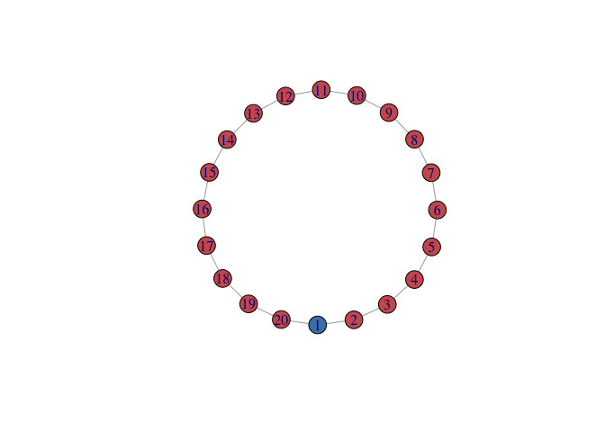
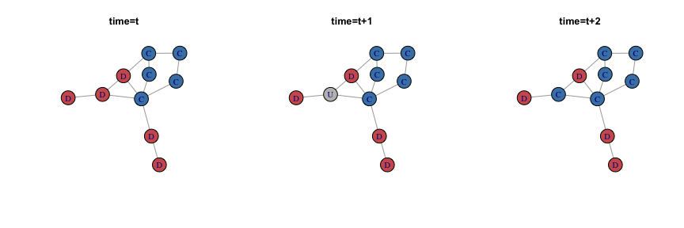
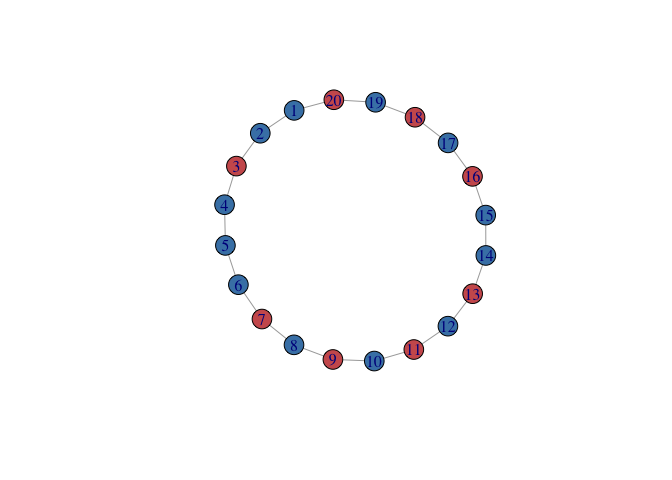

simulation testing in small circular graph - def fitness
================
Bianca Brusco
11/27/2017

``` r
library(igraph)
library(statnet)
library(sna)
```

First of all: work on simulation by creating a 10 nodes circle graph

``` r
n = 20
testG = make_ring(n, directed=FALSE)
plot(testG)
```


``` r
V(testG)$type = c("C",rep("D",n-1))
V(testG)$color = V(testG)$type
V(testG)$color=gsub("C","steel blue",V(testG)$color)
V(testG)$color=gsub("D","indian red",V(testG)$color)

V(testG)$fitness = c(rep("0",n))

#count number of cooperators (for whole network)
i = sum(V(testG)$type == "C")

#bi- ck

#assign fitness to each node based on cooperating/def neighbours

# random values for testing
benf = 100
cost = 1


defFit = function(net,v){
  
  ## this function defines network for a given node in a network
  
  
  
  ## should make it more robust to networks that might not 
  ## have fitness attribute and blabla
  i = sum(neighbors(net,v)$type == "C")
  k = length(neighbors(net, v))
  
  
  ## assign cost ONLY to cooperators
  
  if (V(net)$type[v] == "C"){
      fit = benf * i - cost * k
  }
  else if (V(net)$type[v] == "D"){
      fit = benf * i 
  }
  
  
  return = fit
  
}

# sum(neighbors(testG,2)$type == "C")
# k = length(neighbors(testG,2))
# V(testG)$fitness[2] = benf*i - cost*k
# 
# V(testG)$fitness[2]

defFit(testG, 1)

V(testG)$fitness[1]
```

    ## [1] "0"

``` r
##define  this is a fitness function
for( v in 1:n)
{
  V(testG)$fitness[v] = defFit(testG, v)
}

V(testG)$fitness
```

    ##  [1] "-2"  "100" "0"   "0"   "0"   "0"   "0"   "0"   "0"   "0"   "0"  
    ## [12] "0"   "0"   "0"   "0"   "0"   "0"   "0"   "0"   "100"

``` r
#plot(make_lattice(c(1,1,1,1)))

plot(testG)
```



Death-birth updating, i.e (for sample network):

``` r
edgelist=matrix(c(1,2,1,3,2,4,3,5,4,5,2,7,5,7,6,7,5,6,6,9,5,8,8,10),ncol = 2,byrow = T)
g=graph_from_edgelist(edgelist,directed=F)
coop=c(rep("C",5),rep("D",5))
V(g)$coop=coop
V(g)$color=V(g)$coop
V(g)$color=gsub("C","steel blue",V(g)$color)
V(g)$color=gsub("D","indian red",V(g)$color)

g2=graph_from_edgelist(edgelist,directed = F)
coop2=c(rep("C",5),"U",rep("D",4))
V(g2)$coop2=coop2
V(g2)$color=V(g2)$coop2
V(g2)$color=gsub("C","steel blue",V(g2)$color)
V(g2)$color=gsub("D","indian red",V(g2)$color)
V(g2)$color=gsub("U","grey",V(g2)$color)

g3=graph_from_edgelist(edgelist,directed=F)
coop3=c(rep("C",6),rep("D",4))
V(g3)$coop3=coop3
V(g3)$color=V(g3)$coop3
V(g3)$color=gsub("C","steel blue",V(g3)$color)
V(g3)$color=gsub("D","indian red",V(g3)$color)


par(mfrow=c(1,3))
lay=layout.fruchterman.reingold(g)
plot(g,vertex.label=V(g)$coop,vertex.size=25, layout=lay)
title("time=t")
plot(g2,vertex.label=V(g2)$coop2,vertex.size=25, layout=lay)
title("time=t+1")
plot(g3,vertex.label=V(g3)$coop3,vertex.size=25, layout=lay)
title("time=t+2")
```



Back to the circle netowrk with 20 nodes --- update death-birth each node and

``` r
# todo: put in function

for(v in 1:n){
  
  #death
  # V(testG)$type[i] = NULL

  #birth

  ## QUESTION TO THINK: do i update the initial cooperator as well? does that make sense? test how it changes if 
  #no intiial coop
    
 #what is the fitness if it were to be a cooperator?
  V(testG)$type[v] = "C"
      fc = defFit(testG,v)
 #what is the fitness if it were to be a defector?
  V(testG)$type[v] = "D"
      fd = defFit(testG,v)
  # probability of being a cooperator
  p = fc/(fc+fd) 
  
  V(testG)$type[v] = sample(c("C","D"), size=1, prob=c(p,1-p))
}


V(testG)$type
```

    ##  [1] "C" "C" "D" "C" "C" "C" "D" "C" "D" "C" "D" "C" "D" "C" "C" "D" "C"
    ## [18] "D" "C" "D"

``` r
V(testG)$color = V(testG)$type
V(testG)$color=gsub("C","steel blue",V(testG)$color)
V(testG)$color=gsub("D","indian red",V(testG)$color)


plot(testG)
```



Next -- simulate 1000 times, what is distribution of cooperators in this ring network?
